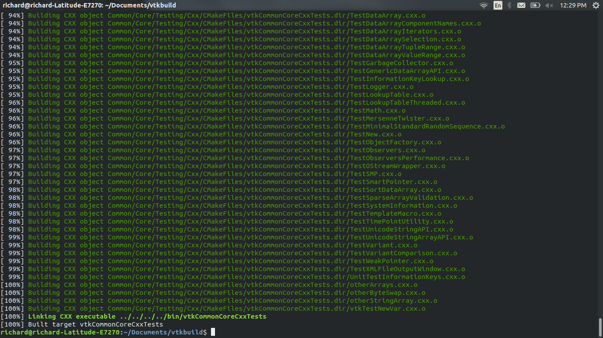
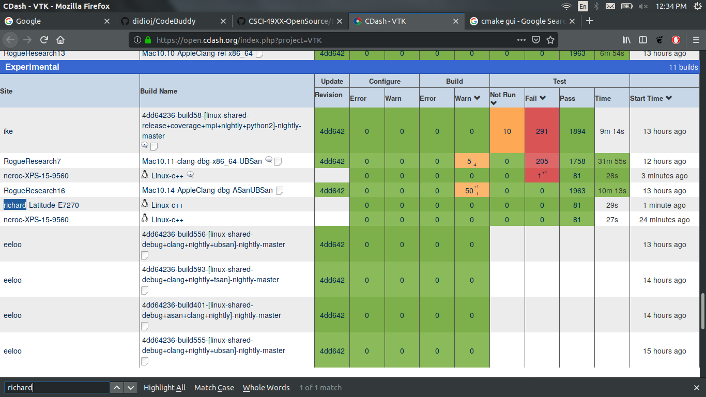
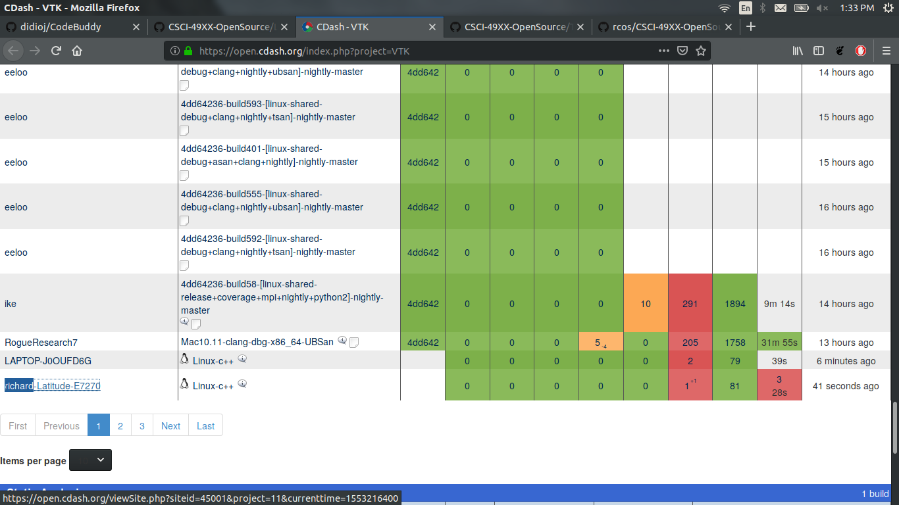
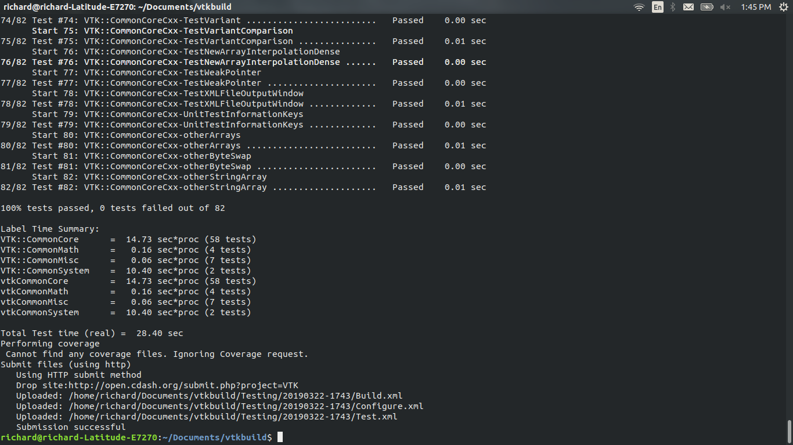

# Checkpoint 1  

# Checkpoint 2  

# Checkpoint 3  

# Checkpoint 4  

I could not get it tp update on vtk dashboard out of nowhere for some reason, but here is proof that it compiled the test right. Notice it says 82 tests because I added the 1.   

